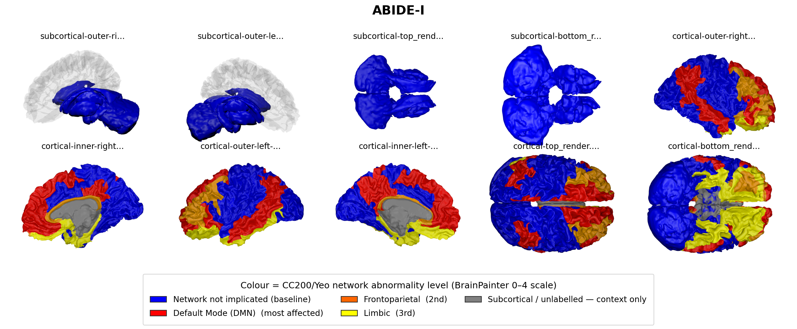
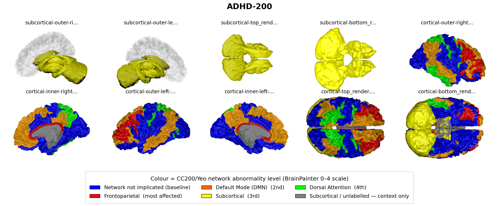
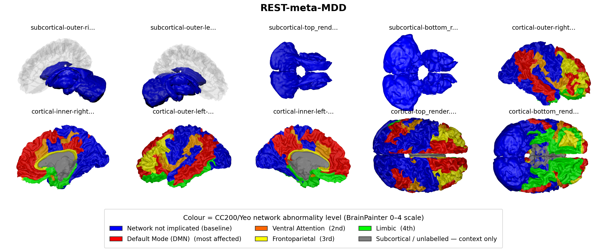
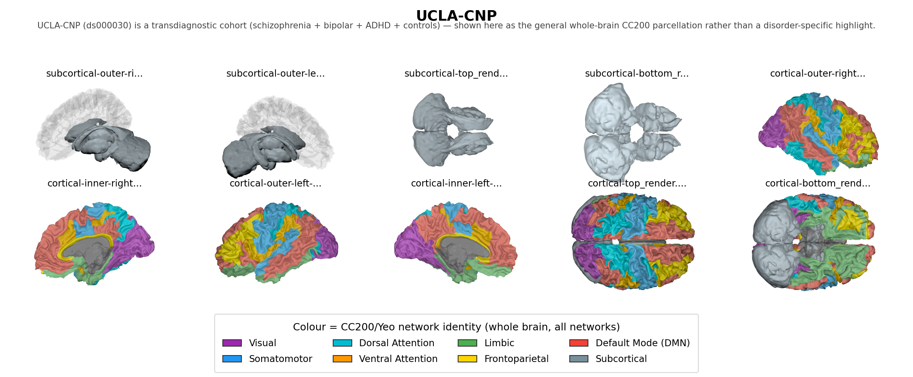

# Quantum-Assisted Adaptive Graph Construction and Temporal Pattern Analysis

A hybrid quantum–classical framework for representation learning on multivariate
temporal data. Instead of assuming a fixed relational structure between variables,
the system **derives graph topology from quantum latent states** and propagates
features over that learned topology with graph attention.

```
multivariate time series
        │
        ▼
  angle encoding ──▶ variational quantum circuit ──▶ ⟨Z⟩ expectation values
        │                                                    │
        │                                              latent embeddings z
        ▼                                                    │
  adaptive edge learning  ◀────── quantum fidelity |⟨ψi|ψj⟩|² ┘
        │
        ▼
  differentiable adjacency ──▶ graph attention propagation ──▶ fused representation
        │                                                              │
        └──────────── hybrid optimisation (backprop + parameter shift) ─┘
```

## Why

Deep graph networks tend to **over-smooth**: as depth grows, node embeddings converge
toward one another, which suppresses exactly the sparse, irregular nodes that anomaly
detection is meant to surface. And most pipelines fix the graph up front, so evolving
relationships never make it into the model.

This framework addresses both. Topology is recomputed from the current latent states on
every forward pass, and propagation is attention-weighted with learnable skip aggregation
so shallow, less-smoothed features survive to the output.

## Two things live here

1. **A general framework** (`qagta.quantum`, `qagta.graph`, `qagta.models`) —
   quantum encoding, adaptive edge learning, attention propagation, hybrid
   optimisation, usable on any multivariate temporal data.
2. **An fMRI connectome study** (`qagta.data.abide`, `qagta.graph.connectome`,
   `qagta.training.lso`) — functional-connectivity classification on ABIDE with
   Leave-Site-Out validation against classical baselines. Start at
   [docs/SETUP.md](docs/SETUP.md) and [docs/DATASETS.md](docs/DATASETS.md).

## Install

```bash
python3.13 -m venv .venv && source .venv/bin/activate
pip install -e ".[dev,viz,quantum,neuro]"
```

`quantum` brings PennyLane + the lightning simulator; `neuro` brings nilearn for
dataset access. The built-in PyTorch simulator needs neither, so
`pip install -e ".[dev]"` is enough for the generic framework.

Optional Qiskit backend:

```bash
pip install -e ".[qiskit]"
```

## The connectome study

```bash
python scripts/download_abide.py          # 1035 subjects, 20 sites, ~406 MB
python scripts/run_abide_study.py --epochs 30
```

Per subject, 200 CC200 brain regions become graph nodes; each region's BOLD time
series is PCA-compressed to 16 features, encoded by a 16-qubit ring-entangled
circuit, and the pairwise **quantum fidelity** `|⟨ψi|ψj⟩|²` between regions
initialises a k-NN-sparsified topology that a graph attention network classifies
over. Compared against SVM (linear/RBF) on correlation matrices and GCN on
Pearson and RBF graphs, all under identical Leave-Site-Out folds.

`docs/DATASET_CANDIDATES.md` surveys additional journal-published cohorts
(ADHD-200, SRPBS, UCLA CNP, COBRE, REST-meta-MDD) for extending beyond a single
disorder, with access routes and the effort each requires.

### Quantum backend

Two interchangeable backends, pinned to agree numerically in CI (expectation
values to 1e-5, statevector overlap > 0.99999, gradients to 1e-4):

| backend | per subject (200 regions, fwd+bwd) | |
|---|---|---|
| `--backend torch` | **1.9 s** | batched statevector, default |
| `--backend pennylane` | ~12.6 s | `lightning.qubit`, adjoint differentiation |

The speedup is an execution-strategy win — the workload is the same circuit run
once per region, which vectorises — not an approximation. See
[docs/SETUP.md](docs/SETUP.md) for the reasoning and the compute profile.

## Quick start

```bash
python scripts/generate_data.py --samples 300 --features 10 --out data/synthetic.csv
python scripts/run_pipeline.py --data data/synthetic.csv
```

Or on your own CSV — feature columns plus a binary label column:

```bash
python scripts/run_pipeline.py --data yourdata.csv --label-column attack
```

As a library:

```python
from qagta import PipelineConfig, QuantumAdaptiveGraphPipeline
from qagta.data import load_csv_dataset

split = load_csv_dataset("data/synthetic.csv")

pipeline = QuantumAdaptiveGraphPipeline(PipelineConfig(), input_dim=split.n_features)
pipeline.fit(split.x_train)

result = pipeline.evaluate(split.x_test, split.y_test)
print(result.summary())
```

Training is one-class: only normal samples are used for fitting, and the held-out set
mixes unseen normal samples with anomalies.

## How it works

**Quantum encoding.** Inputs are projected to one rotation angle per qubit, normalised,
and squashed into `[0, 2π]`. A parameterised circuit (angle-encoding feature map plus a
RealAmplitudes-style entangling ansatz) prepares a state whose Pauli-Z expectation values
`⟨ψ(θ)|Z_k|ψ(θ)⟩` form the latent vector. The statevector itself is retained so quantum
fidelity can be used downstream.

The angle normalisation matters more than it looks. Without it the learned projection
collapses onto one or two qubits, the rest sit at a near-constant rotation, every prepared
state looks alike, all pairwise fidelities approach 1, and the quantum similarity term
stops carrying information. On the bundled synthetic benchmark that single issue was worth
0.62 → 0.97 AUC.

**Adaptive edge learning.** Edge weights come from a parametric kernel mixing four
similarity notions:

```
W_ij = α·cosine(z_i, z_j) + β·learnable(z_i, z_j) + γ·attention(z_i, z_j) + δ·fidelity(ψ_i, ψ_j)
```

The mixing coefficients are trainable (softmax-normalised), so the balance between the
terms is itself learned. Candidate edges come from k-nearest-neighbour sparsification;
retained weights stay differentiable, so gradients from the graph objective reach both the
kernel and the quantum circuit.

**Propagation and fusion.** The adjacency drives a multi-head graph attention stack that
consumes the learned edge weights, with learnable weighted aggregation over per-layer skip
projections. A gated decision module fuses graph context with the original quantum latent.

**Training.** Stage one pre-trains the quantum autoencoder on a reconstruction objective.
Stage two trains topology construction and propagation on *contextual* latent
reconstruction: part of each node's own latent is masked before fusion, so the target can
only be recovered from what the graph propagates in from neighbours. Leaving the node's own
latent intact makes the objective satisfiable by an identity mapping, and the graph learns
nothing.

**Hybrid optimisation.** Classical parameters update by backpropagation. Quantum circuit
parameters can co-adapt in the same loop, either through autograd on the built-in simulator
or through the **parameter-shift rule** — the route that remains valid on shot-based
backends and real hardware. The test suite verifies the two agree to 1e-4.

## Configuration

Every stage is configurable via YAML (see [configs/default.yaml](configs/default.yaml)):

```bash
python scripts/run_pipeline.py --data data/synthetic.csv --config configs/default.yaml
```

Notable knobs: `quantum.n_qubits` (sets latent dimensionality), `graph.k_neighbors` and
`graph.edge_threshold` (topology density), `graph.use_fidelity` (quantum similarity term),
`model.encoder` (`gat` or `sage`), and `training.quantum_gradient`
(`autograd` or `parameter_shift`).

## Cohorts and the networks reported for them

All four cohorts use the CC200 parcellation (Craddock 2012), whose 200 regions
map onto the seven canonical Yeo networks plus subcortical structures. The
renderings below show which networks the clinical literature reports as
disrupted in each disorder — red most affected, then orange, then yellow, with
blue marking networks not implicated and grey unlabelled subcortical context.

**These summarise prior literature, not results from this repository.** No
experiment here localises a network: the models operate on the whole brain with
no regional prior, and the graph configurations sit at chance
(`findings/06`). They are included to situate the cohorts.

### ABIDE I — autism, default-mode leading



### ADHD-200 — frontoparietal leading



### REST-meta-MDD — default-mode, reported as *hyper*-connectivity



### UCLA-CNP — transdiagnostic, shown as the parcellation itself

UCLA-CNP (ds000030) spans schizophrenia, bipolar disorder, ADHD and controls,
so no single disorder profile applies. Its panel instead shows the CC200/Yeo
parcellation coloured by network identity — which doubles as the atlas
reference for all four cohorts, since every cohort here uses the same
parcellation.



Renderings produced with **BrainPainter**:

> R. V. Marinescu, A. Eshaghi, D. C. Alexander and P. Golland.
> *BrainPainter: A software for the visualisation of brain structures,
> biomarkers and associated pathological processes.*
> Multimodal Brain Image Analysis and Mathematical Foundations of
> Computational Anatomy (MBIA/MFCA), LNCS 11846:112–120, 2019.
> [arXiv:1905.08627](https://arxiv.org/abs/1905.08627) ·
> [source](https://github.com/razvanmarinescu/brain-coloring)

Network assignments follow Yeo et al. (2011); the disorder-specific rankings
are drawn from the literature cited in the manuscript.

## Layout

```
src/qagta/
  quantum/    differentiable statevector simulator, encoder, fidelity, Qiskit backend
  graph/      adaptive edge learning, dynamic graph construction
  models/     graph attention and SAGE encoders, gated decision module
  training/   hybrid training loops, parameter-shift rule, evaluation
  data/       loaders, one-class splits, synthetic generator
  pipeline.py end-to-end orchestration
scripts/      data generation and pipeline runner
tests/        41 tests covering all subsystems
```

## Tests

```bash
pytest
```

Coverage includes statevector normalisation and entanglement against analytic results,
parameter-shift gradients against autograd, edge-kernel differentiability, over-smoothing
resistance, and end-to-end pipeline behaviour.

## License

Apache-2.0. See [LICENSE](LICENSE).

> Note on scope: this repository is a general, self-contained implementation of the
> architecture. It is not a disclosure document, and it deliberately omits filing-specific
> material. Source specification PDFs are excluded from version control via `.gitignore`.
